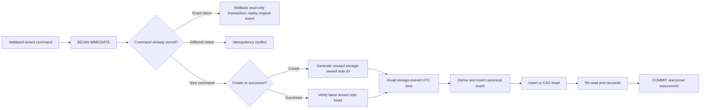
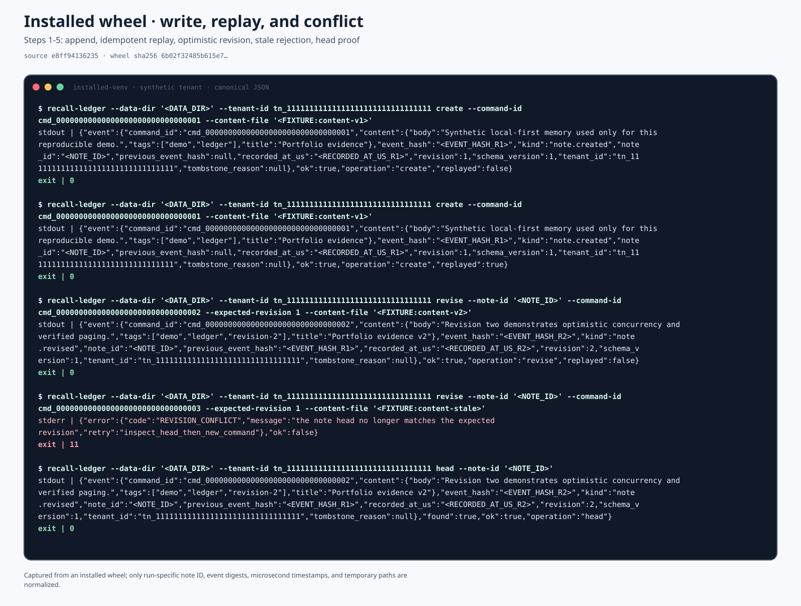
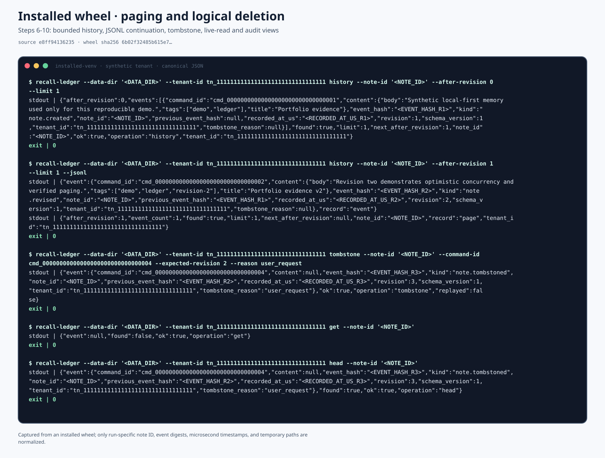
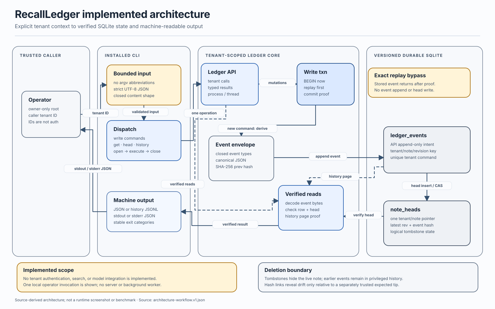
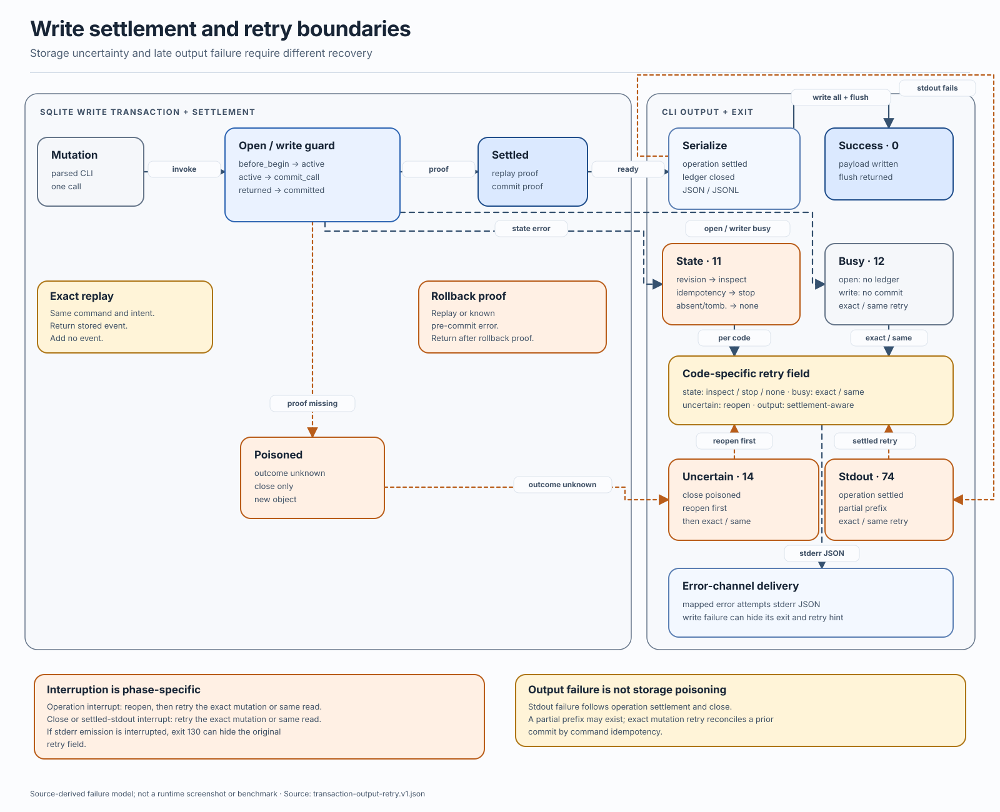

# RecallLedger

RecallLedger is being rebuilt as a local-first, tenant-isolated memory and
retrieval engine for AI assistants. The project will focus on the parts that
simple note demos usually avoid: ownership invariants, event provenance,
rebuildable indexes, deletion semantics, prompt-injection boundaries, and
measured hybrid retrieval.

It is not currently a Telegram bot or a generic CRUD application.

> **Phase 3b — installed lexical search CLI.** The current tree combines bounded,
> canonical, tenant-scoped note events with a versioned, locked SQLite
> boundary, transactional create/revise/tombstone/head/history operations, and
> a deterministic tenant-local search oracle over every verified current head.
> The installed `recall-ledger` console script exposes that reference path as
> canonical JSON or JSONL. No authorization adapter, persistent retrieval
> index, model integration, evaluation benchmark, or user interface is claimed
> yet.

The storage slice currently supports Linux/POSIX deployments only. Its
`fcntl`, `flock`, `O_DIRECTORY`, `O_NOFOLLOW`, and fork-safety contract is
explicit rather than pretending to be portable across incompatible file
semantics.

## Why the old design was retired

The historical prototype stored every note in one SQLite table without a user
or tenant key. Any bot user could list, search, open, delete, or delete all
notes in the shared database. User-supplied titles and bodies were inserted
into Telegram HTML-mode messages without escaping. The runtime also had no
migration discipline, dependency lock, authorization tests, resource limits,
or safe confirmation flow for destructive actions.

That code has been removed from the current tree. It remains in Git history
for provenance and must not be deployed.

## Technical direction

Development will proceed in reviewable layers:

1. **Tenant-isolated event log** — versioned note events, immutable ownership,
   optimistic concurrency, deterministic projections, SQLite migrations, and
   tests proving that cross-tenant reads and writes fail closed.
2. **Rebuildable retrieval** — the normalization, tokenization, exact scoring,
   bounded reference scan, and citation contracts are implemented first;
   source-bound FTS5 acceleration and full index reconstruction come next.
3. **Hybrid search laboratory** — a provider boundary for optional local
   embeddings, reciprocal-rank fusion, diversity controls, and frozen
   lexical/semantic/adversarial evaluation slices. The dependency-free lexical
   baseline comes first.
4. **AI memory safety** — note content remains untrusted data, never hidden
   instructions. Retrieval results carry citations and provenance; ingestion
   and prompt assembly keep control text separate from note text.
5. **Verifiable deletion** — tombstones, projection/index removal, backup and
   retention boundaries, and evidence showing what deletion does and does not
   erase.
6. **Adapters and evidence** — the installed operator CLI is the first thin
   adapter. Authenticated network adapters, including a possible Telegram
   interface, come later. Executable paths are documented with real captures,
   source-bound diagrams, source-derived evaluation plots, and reproducible
   end-to-end recordings.

Optional LLM or embedding integrations must use free/local implementations by
default and remain outside the correctness boundary of storage, ownership, and
deletion.

## Implemented now

`recall_ledger.events` provides an immutable event vocabulary for note creation,
revision, and logical deletion. Successors inherit tenant and note identity
from the previous event instead of accepting either value again. Envelopes use
strict canonical JSON, domain-separated SHA-256 links, exact types, closed
keys, strict UTF-8, and explicit resource bounds.

`recall_ledger.storage` now establishes the durable format boundary: a trusted
absolute `0700` data directory, fixed owner-only database and cooperative-lock
files, SQLite 3.37+ `STRICT` tables, exact checksummed migrations, closed schema
validation, foreign-key checks, a bounded defensive connection profile,
rollback journaling with `synchronous=FULL`, and process/thread ownership. The
rollback journal avoids the known multi-connection WAL-reset corruption window
in unpatched SQLite runtimes.

The transaction API generates note IDs and UTC microsecond timestamps inside
the storage boundary. Each mutation uses `BEGIN IMMEDIATE`, checks tenant-wide
command idempotency before reading the clock, derives a canonical event from
the verified stored head, inserts the event, and inserts or compare-and-swaps
the head before commit. Exact retries return the original event; reuse of a
command for a different intent fails closed. Head and history reads decode the
canonical event BLOB and reconcile every duplicated relational field.

`recall_ledger.retrieval` defines a profile-bound `NFKC → casefold → NFKC`
lexical contract, inert UTF-8-hex candidate tokens, all-terms matching, and an
integer scorer with reviewable field-frequency and phrase components. Public
derived values cannot be constructed or restored from serialized state, and
every consumer revalidates hostile low-level mutation.

`SQLiteLedger.search_notes` is the correctness oracle for future indexes. It
compiles raw query text inside the boundary, then verifies every tenant head
and the distinct event-note inventory in one read snapshot. The scan includes
tombstones and off-query heads for integrity, caps the complete inventory at
1,000 heads and live UTF-8 content at 16 MiB, and returns no prefix on overflow
or corruption. Only decoded live heads are scored. Hits sort by integer score,
current-head time, and note ID; each carries the current revision and event
hash as a citation. The result also exposes exact scanned-head, live-note, and
content-byte counts. This reference path intentionally has no FTS5 table yet.



`recall_ledger.cli` is an installed, dependency-free operator boundary. It
accepts an explicit trusted data directory and tenant context, reads note
content and lexical queries from bounded regular files or standard input, and
emits one canonical JSON document per invocation. History and search can
instead emit canonical JSONL. Search returns the compiled profile, exact score
breakdowns, 1-based ranks, current-head citations, full-scan accounting, and an
explicit truncation flag. Query text is not accepted in argv or silently
trimmed. Mutations surface exact command replay, revision conflicts,
busy/uncertain settlement, storage-safety failures, and output-delivery
failures through documented exit categories and retry guidance. The CLI does
not authenticate the supplied tenant identifier. JSONL is currently a
machine-readable representation, not incremental transport: the bounded result
is serialized after the ledger closes and can expand materially under JSON
escaping.

The exact guarantees, deployment preconditions, failure states, and non-claims
are in the [SQLite storage boundary](docs/storage-boundary.md) and
[transaction contract](docs/transaction-contract.md).

Hashes reveal mutation only when a verifier holds an authenticated latest
checkpoint or expected tip. Trusting the creation event alone does not detect
valid forks or truncation, and hashes do not prove authorization or make an
attacker-controlled ledger trustworthy. Details and the exact schema are in
[the event contract](docs/event-contract.md).

## Install and operate

Build the wheel with the pinned local toolchain, then install it into an empty
environment without resolving runtime dependencies:

```bash
python3 -m venv .venv
. .venv/bin/activate
python -m pip install '.[dev]'
python -m build --wheel --no-isolation

python3 -m venv .runtime
.runtime/bin/python -m pip install --no-index --no-deps --no-compile \
  dist/recall_ledger-0.1.0-py3-none-any.whl
.runtime/bin/recall-ledger --help
```

The caller must create an existing absolute operator-owned `0700` data
directory. Tenant IDs are trusted context, not credentials:

```bash
install -d -m 0700 ./local-ledger
DATA_DIR="$(pwd -P)/local-ledger"

.runtime/bin/recall-ledger \
  --data-dir "$DATA_DIR" \
  --tenant-id tn_11111111111111111111111111111111 \
  create \
  --command-id cmd_00000000000000000000000000000001 \
  --content-file docs/visuals/fixtures/cli-content-v1.json

printf '%s' 'portfolio evidence' | .runtime/bin/recall-ledger \
  --data-dir "$DATA_DIR" \
  --tenant-id tn_11111111111111111111111111111111 \
  search \
  --query-file - \
  --limit 5 \
  --jsonl
```

The synthetic IDs and content above are reproducible documentation fixtures;
they are not credentials or user data.

## Verified installed-wheel workflow

These are rendered from a real ten-command run of the installed console script,
not a hand-written mock terminal. The capture starts from a clean Git archive,
builds one wheel with the pinned toolchain, installs it offline into an empty
virtual environment, externally hashes the installed package and wrapper, and
then validates raw stdout, stderr, exit codes, event hashes, replay, paging,
conflict, and tombstone semantics before any normalization.



The first panel proves create, exact-command idempotent replay of the same
stored event, revision 2, a rejected stale revision with exit 11, and an
unchanged head.



The second panel proves bounded JSON/JSONL history continuation, a content-free
revision 3 tombstone, a live read that hides the deleted note, and an audit head
that retains the terminal event.

Only the run-specific note ID, three event digests, three microsecond
timestamps, and temporary filesystem paths are normalized. The complete
normalized canonical transcript, source commit and tree, capture-input
manifest, wheel and `RECORD` hashes, builder versions, installed-file digest,
and verification assertions are reviewable in
[the evidence JSON](docs/visuals/evidence/installed-wheel-cli.v1.json).

## Source-bound architecture and failure behavior





Both diagrams are bound to named implementation symbols and exact written
contracts. Their scope, regeneration commands, and non-claims are documented
in [the visual evidence index](docs/visuals/README.md).

## Verify from source

```bash
python3 -m venv .venv
. .venv/bin/activate
python3 -m pip install -e '.[dev]'
pytest
ruff check .
ruff format --check .
mypy
```

## Evidence policy

Visuals are committed only when the corresponding executable path exists.
Each screenshot, diagram, plot, or recording must name its source fixture and
regeneration command, pass a freshness check, and contain no private notes,
identifiers, tokens, or personal data. Speculative mockups are not evidence.

The current installed-wheel transcripts, source-bound architecture and failure
diagram, their versioned inputs, regeneration commands, and non-claims are
documented in [the visual evidence index](docs/visuals/README.md).

Benchmarks will compare simple lexical and recency baselines before claiming
that embeddings or an LLM improve retrieval. Evaluation fixtures will be
synthetic or openly licensed and frozen by content hash.

## Security

Notes, retrieval queries, generated prompts, filenames, adapter callbacks, and
model output are untrusted. Do not commit production database files, namespace
exports, bot tokens, embeddings derived from private text, screenshots of real
notes, or user identifiers.

See [SECURITY.md](SECURITY.md) for the trust boundaries and disclosure process.

## License

[MIT](LICENSE)
