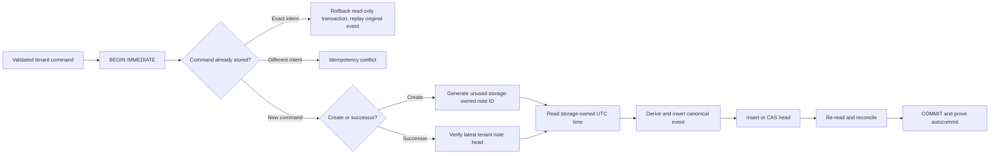

# RecallLedger

RecallLedger is being rebuilt as a local-first, tenant-isolated memory and
retrieval engine for AI assistants. The project will focus on the parts that
simple note demos usually avoid: ownership invariants, event provenance,
rebuildable indexes, deletion semantics, prompt-injection boundaries, and
measured hybrid retrieval.

It is not currently a Telegram bot or a generic CRUD application.

> **Phase 2b — atomic ledger.** The current tree combines bounded, canonical,
> tenant-scoped note events with a versioned, locked SQLite boundary and
> transactional create, revise, tombstone, head, and history operations. No
> authorization adapter, search API, model integration, benchmark, CLI, or
> user interface is claimed yet.

The storage slice currently supports Linux/POSIX deployments only. Its
`fcntl`, `flock`, `O_DIRECTORY`, `O_NOFOLLOW`, and fork-safety contract is
explicit rather than pretending to be portable across incompatible file
semantics.

## Why the old design was retired

The historical prototype stored every note in one SQLite table without a user
or tenant key. Any bot user could list, search, open, delete, or delete all
notes in the shared database. User-supplied titles and bodies were inserted
into Telegram HTML-mode messages without escaping. The runtime also had no
migration discipline, dependency lock, authorization tests, resource limits,
or safe confirmation flow for destructive actions.

That code has been removed from the current tree. It remains in Git history
for provenance and must not be deployed.

## Technical direction

Development will proceed in reviewable layers:

1. **Tenant-isolated event log** — versioned note events, immutable ownership,
   optimistic concurrency, deterministic projections, SQLite migrations, and
   tests proving that cross-tenant reads and writes fail closed.
2. **Rebuildable retrieval** — source-bound FTS5 indexes, explicit tokenization
   and normalization contracts, stable ranking evidence, and full index
   reconstruction from the event log.
3. **Hybrid search laboratory** — a provider boundary for optional local
   embeddings, reciprocal-rank fusion, diversity controls, and frozen
   lexical/semantic/adversarial evaluation slices. The dependency-free lexical
   baseline comes first.
4. **AI memory safety** — note content remains untrusted data, never hidden
   instructions. Retrieval results carry citations and provenance; ingestion
   and prompt assembly keep control text separate from note text.
5. **Verifiable deletion** — tombstones, projection/index removal, backup and
   retention boundaries, and evidence showing what deletion does and does not
   erase.
6. **Adapters and evidence** — thin authenticated adapters, including a
   possible Telegram interface, followed by real CLI and UI captures,
   architecture and retrieval diagrams, source-derived evaluation plots, and
   a reproducible end-to-end recording.

Optional LLM or embedding integrations must use free/local implementations by
default and remain outside the correctness boundary of storage, ownership, and
deletion.

## Implemented now

`recall_ledger.events` provides an immutable event vocabulary for note creation,
revision, and logical deletion. Successors inherit tenant and note identity
from the previous event instead of accepting either value again. Envelopes use
strict canonical JSON, domain-separated SHA-256 links, exact types, closed
keys, strict UTF-8, and explicit resource bounds.

`recall_ledger.storage` now establishes the durable format boundary: a trusted
absolute `0700` data directory, fixed owner-only database and cooperative-lock
files, SQLite 3.37+ `STRICT` tables, exact checksummed migrations, closed schema
validation, foreign-key checks, a bounded defensive connection profile,
rollback journaling with `synchronous=FULL`, and process/thread ownership. The
rollback journal avoids the known multi-connection WAL-reset corruption window
in unpatched SQLite runtimes.

The transaction API generates note IDs and UTC microsecond timestamps inside
the storage boundary. Each mutation uses `BEGIN IMMEDIATE`, checks tenant-wide
command idempotency before reading the clock, derives a canonical event from
the verified stored head, inserts the event, and inserts or compare-and-swaps
the head before commit. Exact retries return the original event; reuse of a
command for a different intent fails closed. Head and history reads decode the
canonical event BLOB and reconcile every duplicated relational field.



The exact guarantees, deployment preconditions, failure states, and non-claims
are in the [SQLite storage boundary](docs/storage-boundary.md) and
[transaction contract](docs/transaction-contract.md).

Hashes reveal mutation only when a verifier holds an authenticated latest
checkpoint or expected tip. Trusting the creation event alone does not detect
valid forks or truncation, and hashes do not prove authorization or make an
attacker-controlled ledger trustworthy. Details and the exact schema are in
[the event contract](docs/event-contract.md).

```bash
python3 -m venv .venv
. .venv/bin/activate
python3 -m pip install -e '.[dev]'
pytest
ruff check .
ruff format --check .
mypy
```

## Evidence policy

Visuals will be added only when the corresponding executable path exists.
Each screenshot, diagram, plot, or recording must name its source fixture and
regeneration command, pass a freshness check, and contain no private notes,
identifiers, tokens, or personal data. Speculative mockups are not evidence.

Benchmarks will compare simple lexical and recency baselines before claiming
that embeddings or an LLM improve retrieval. Evaluation fixtures will be
synthetic or openly licensed and frozen by content hash.

## Security

Notes, retrieval queries, generated prompts, filenames, adapter callbacks, and
model output are untrusted. Do not commit production database files, namespace
exports, bot tokens, embeddings derived from private text, screenshots of real
notes, or user identifiers.

See [SECURITY.md](SECURITY.md) for the trust boundaries and disclosure process.

## License

[MIT](LICENSE)
