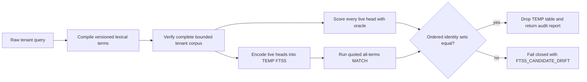
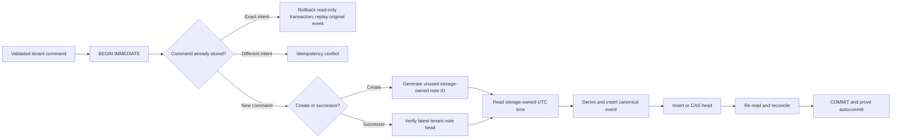
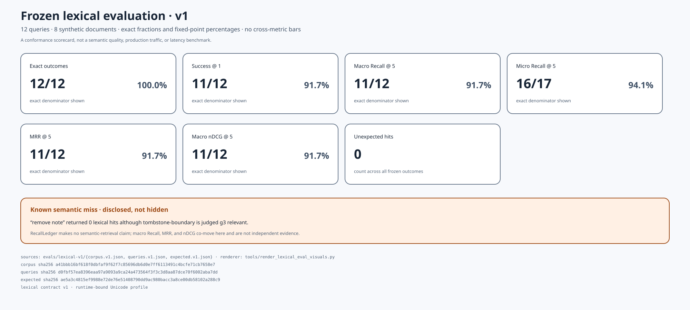
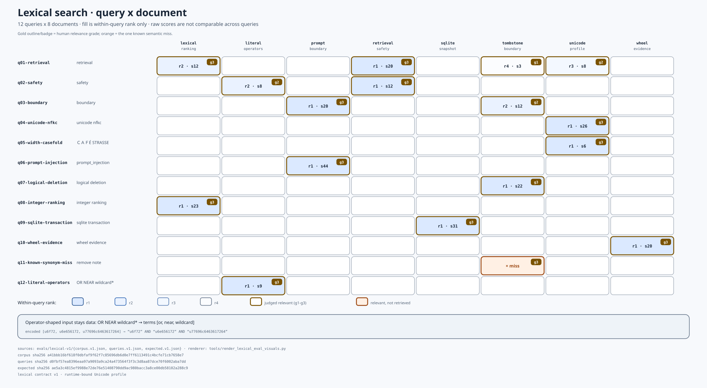
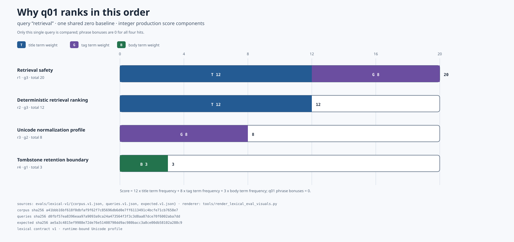
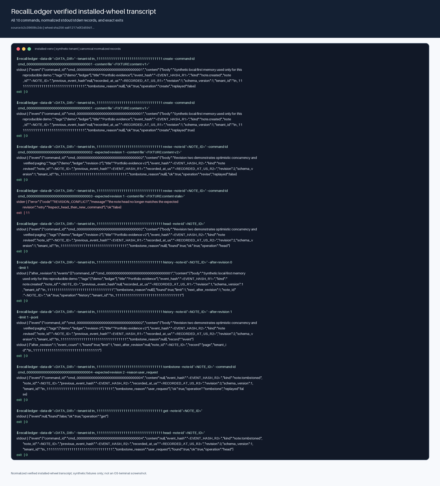
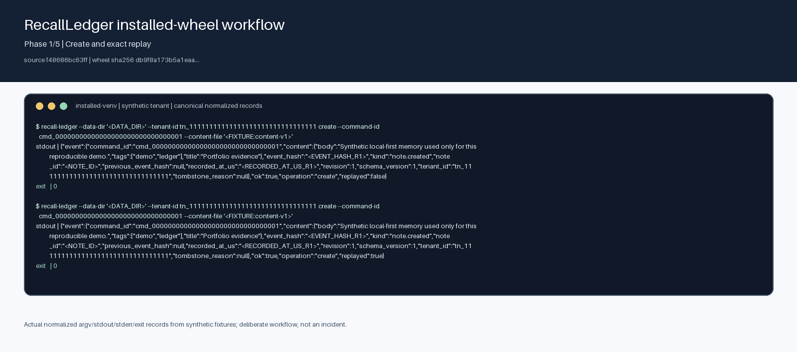
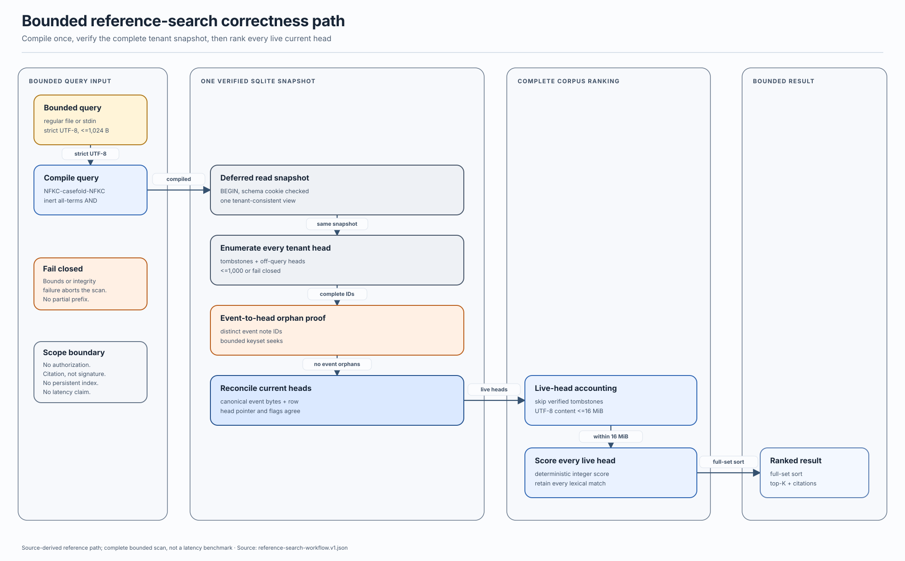

# RecallLedger

RecallLedger is being rebuilt as a local-first, tenant-isolated memory and
retrieval engine for AI assistants. The project will focus on the parts that
simple note demos usually avoid: ownership invariants, event provenance,
rebuildable indexes, deletion semantics, prompt-injection boundaries, and
measured hybrid retrieval.

It is not currently a Telegram bot or a generic CRUD application.

> **Phase 3d — fail-closed FTS5 candidate calibration.** The current tree combines
> canonical tenant-scoped events, a locked SQLite boundary, and a deterministic
> search oracle over every verified current head. A separate public audit now
> rebuilds an ephemeral tenant-local FTS5 candidate table from that same
> verified snapshot and requires exact candidate-set agreement with the oracle.
> The frozen lexical suite still records the scorer's known synonym miss. No
> authorization adapter, persistent retrieval index, serving-speed claim,
> semantic-search benchmark, model integration, or user interface is claimed.

The storage slice currently supports Linux/POSIX deployments only. Its
`fcntl`, `flock`, `O_DIRECTORY`, `O_NOFOLLOW`, and fork-safety contract is
explicit rather than pretending to be portable across incompatible file
semantics.

## Why the old design was retired

The historical prototype stored every note in one SQLite table without a user
or tenant key. Any bot user could list, search, open, delete, or delete all
notes in the shared database. User-supplied titles and bodies were inserted
into Telegram HTML-mode messages without escaping. The runtime also had no
migration discipline, dependency lock, authorization tests, resource limits,
or safe confirmation flow for destructive actions.

That code has been removed from the current tree. It remains in Git history
for provenance and must not be deployed.

## Technical direction

Development will proceed in reviewable layers:

1. **Tenant-isolated event log** — versioned note events, immutable ownership,
   optimistic concurrency, deterministic projections, SQLite migrations, and
   tests proving that cross-tenant reads and writes fail closed.
2. **Rebuildable retrieval** — normalization, tokenization, exact scoring,
   bounded reference scan, citations, and a source-bound TEMP FTS5 equivalence
   audit are implemented. A durable projection, crash-safe full reconstruction,
   and measured acceleration remain future work.
3. **Hybrid search laboratory** — a provider boundary for optional local
   embeddings, reciprocal-rank fusion, diversity controls, and frozen
   lexical/semantic/adversarial evaluation slices. The dependency-free lexical
   baseline comes first.
4. **AI memory safety** — note content remains untrusted data, never hidden
   instructions. Retrieval results carry citations and provenance; ingestion
   and prompt assembly keep control text separate from note text.
5. **Verifiable deletion** — tombstones, projection/index removal, backup and
   retention boundaries, and evidence showing what deletion does and does not
   erase.
6. **Adapters and evidence** — the installed operator CLI is the first thin
   adapter. Authenticated network adapters, including a possible Telegram
   interface, come later. Executable paths are documented with real captures,
   source-bound diagrams, source-derived evaluation plots, and reproducible
   end-to-end recordings.

Optional LLM or embedding integrations must use free/local implementations by
default and remain outside the correctness boundary of storage, ownership, and
deletion.

## Implemented now

`recall_ledger.events` provides an immutable event vocabulary for note creation,
revision, and logical deletion. Successors inherit tenant and note identity
from the previous event instead of accepting either value again. Envelopes use
strict canonical JSON, domain-separated SHA-256 links, exact types, closed
keys, strict UTF-8, and explicit resource bounds.

`recall_ledger.storage` now establishes the durable format boundary: a trusted
absolute `0700` data directory, fixed owner-only database and cooperative-lock
files, SQLite 3.37+ `STRICT` tables, exact checksummed migrations, closed schema
validation, foreign-key checks, a bounded defensive connection profile,
rollback journaling with `synchronous=FULL`, and process/thread ownership. The
rollback journal avoids the known multi-connection WAL-reset corruption window
in unpatched SQLite runtimes.

The transaction API generates note IDs and UTC microsecond timestamps inside
the storage boundary. Each mutation uses `BEGIN IMMEDIATE`, checks tenant-wide
command idempotency before reading the clock, derives a canonical event from
the verified stored head, inserts the event, and inserts or compare-and-swaps
the head before commit. Exact retries return the original event; reuse of a
command for a different intent fails closed. Head and history reads decode the
canonical event BLOB and reconcile every duplicated relational field.

`recall_ledger.retrieval` defines a profile-bound `NFKC → casefold → NFKC`
lexical contract, inert UTF-8-hex candidate tokens, all-terms matching, and an
integer scorer with reviewable field-frequency and phrase components. Public
derived values cannot be constructed or restored from serialized state, and
every consumer revalidates hostile low-level mutation.

`SQLiteLedger.search_notes` is the correctness oracle for future indexes. It
compiles raw query text inside the boundary, then verifies every tenant head
and the distinct event-note inventory in one read snapshot. The scan includes
tombstones and off-query heads for integrity, caps the complete inventory at
1,000 heads and live UTF-8 content at 16 MiB, and returns no prefix on overflow
or corruption. Only decoded live heads are scored. Hits sort by integer score,
current-head time, and note ID; each carries the current revision and event
hash as a citation. The result also exposes exact scanned-head, live-note, and
content-byte counts. The reference search path owns no FTS5 state.

`SQLiteLedger.audit_fts5_candidates` reuses the complete verified tenant
snapshot, encodes every live head into inert lowercase ASCII token streams, and
builds a transaction-local TEMP FTS5 table with the `ascii` tokenizer,
`detail=none`, and `columnsize=0`. It compares the complete ordered candidate
identity set with a separately scored oracle set, drops the TEMP table, and
returns the SQLite runtime plus scan counts only on exact agreement. Drift,
missing FTS5 support, integrity failure, or uncertain transaction state fails
closed. This is a calibration gate, not a persistent index or a latency result;
`search_notes` remains the serving correctness oracle.



```python
audit = ledger.audit_fts5_candidates(
    tenant_id=tenant_id,
    query="portfolio evidence",
)
assert audit.candidate_note_ids == audit.oracle_match_note_ids
```

The write path remains independently transactional:



`recall_ledger.cli` is an installed, dependency-free operator boundary. It
accepts an explicit trusted data directory and tenant context, reads note
content and lexical queries from bounded regular files or standard input, and
emits one canonical JSON document per invocation. History and search can
instead emit canonical JSONL. Search returns the compiled profile, exact score
breakdowns, 1-based ranks, current-head citations, full-scan accounting, and an
explicit truncation flag. Query text is not accepted in argv or silently
trimmed. Mutations surface exact command replay, revision conflicts,
busy/uncertain settlement, storage-safety failures, and output-delivery
failures through documented exit categories and retry guidance. The CLI does
not authenticate the supplied tenant identifier. JSONL is currently a
machine-readable representation, not incremental transport: the bounded result
is serialized after the ledger closes and can expand materially under JSON
escaping.

The exact guarantees, deployment preconditions, failure states, and non-claims
are in the [SQLite storage boundary](docs/storage-boundary.md) and
[transaction contract](docs/transaction-contract.md).

Hashes reveal mutation only when a verifier holds an authenticated latest
checkpoint or expected tip. Trusting the creation event alone does not detect
valid forks or truncation, and hashes do not prove authorization or make an
attacker-controlled ledger trustworthy. Details and the exact schema are in
[the event contract](docs/event-contract.md).

## Install and operate

Build the wheel with the pinned local toolchain, then install it into an empty
environment without resolving runtime dependencies:

```bash
python3 -m venv .venv
. .venv/bin/activate
python -m pip install --require-hashes -r requirements-dev.lock
python -m pip install --no-deps --no-build-isolation --editable .
python -m build --wheel --no-isolation

python3 -m venv .runtime
.runtime/bin/python -m pip install --no-index --no-deps --no-compile \
  dist/recall_ledger-0.1.0-py3-none-any.whl
.runtime/bin/recall-ledger --help
```

The caller must create an existing absolute operator-owned `0700` data
directory. Tenant IDs are trusted context, not credentials:

```bash
install -d -m 0700 ./local-ledger
DATA_DIR="$(pwd -P)/local-ledger"

.runtime/bin/recall-ledger \
  --data-dir "$DATA_DIR" \
  --tenant-id tn_11111111111111111111111111111111 \
  create \
  --command-id cmd_00000000000000000000000000000001 \
  --content-file docs/visuals/fixtures/cli-content-v1.json

printf '%s' 'portfolio evidence' | .runtime/bin/recall-ledger \
  --data-dir "$DATA_DIR" \
  --tenant-id tn_11111111111111111111111111111111 \
  search \
  --query-file - \
  --limit 5 \
  --jsonl
```

The synthetic IDs and content above are reproducible documentation fixtures;
they are not credentials or user data.

## Frozen lexical conformance evaluation

The versioned lexical suite runs twelve hand-authored queries against eight
synthetic current-head documents through the production query compiler and
integer scorer. Every query-document pair has an explicit relevance grade;
the validator recomputes the observed order, exact score components, and
integer metrics before a visual can be rendered.



This is a conformance result, not a production or semantic-search benchmark.
Eleven queries recover their judged targets perfectly; `remove note` retrieves
nothing although `tombstone-boundary` is judged strongly relevant. That miss is
kept visible instead of being tuned away.



Cell fill represents rank only within the same query. Raw scores remain labels,
because totals from different token sets are not comparable. Gold badges show
human relevance grades, including the orange `g3` miss.



The score decomposition compares one query on one shared zero baseline:
title-term frequency contributes 12, tag frequency 8, and body frequency 3
per capped occurrence. The frozen [data card](evals/lexical-v1/DATA_CARD.md),
[corpus](evals/lexical-v1/corpus.v1.json),
[queries and judgments](evals/lexical-v1/queries.v1.json), and
[expected production outcomes](evals/lexical-v1/expected.v1.json) are the only
data sources for these three SVGs.

## Verified installed-wheel workflow

These raster, motion, and vector views all project one real ten-command run of
the installed console script, not hand-written mock output. The capture starts
from a clean Git archive, builds one wheel with the pinned toolchain, installs
it offline into an empty virtual environment, externally hashes the installed
package and wrapper, and validates raw stdout, stderr, exits, event links,
replay, paging, conflict, and tombstone semantics before normalization.



The PNG contains all ten commands and every normalized stdout, stderr, and exit
record. It is deterministic text rendering from synthetic fixtures, not an
OS-terminal screenshot.



The GIF groups the same verified records into five ordered phases of two
commands each. It is a deliberate workflow playback, not an incident recording.


The first detail panel proves create, exact-command idempotent replay of the
same stored event, revision 2, a rejected stale revision with exit 11, and an
unchanged head.


The second detail panel proves bounded JSON/JSONL history continuation, a
content-free revision 3 tombstone, a live read that hides the deleted note, and
an audit head that retains the terminal event.

Only the run-specific note ID, three event digests, three microsecond
timestamps, and temporary filesystem paths are normalized. The complete
canonical records and capture provenance are in
[the evidence JSON](docs/visuals/evidence/installed-wheel-cli.v1.json). The
[generated media manifest](docs/visuals/installed-wheel-media.manifest.json)
pins every hosted output and renderer input; the separate
[adoption review record](docs/visuals/evidence/installed-wheel-media.adoption.json)
ties those exact six bytes to the reviewed workflow run and archive digest. The
record is review provenance, not a signature or cryptographic attestation.

## Source-bound architecture and failure behavior



The focused search path shows why top-K is applied only after a complete,
bounded tenant snapshot has passed head inventory, orphan detection, canonical
event reconciliation, tombstone exclusion, UTF-8 accounting, and full-set
scoring. Bounds or integrity failure abort the operation without a partial
prefix.


All three diagrams are bound to named implementation symbols and exact written
contracts. Their scope, regeneration commands, and non-claims are documented
in [the visual evidence index](docs/visuals/README.md).

## Verify from source

```bash
python3 -m venv .venv
. .venv/bin/activate
python -m pip install --require-hashes -r requirements-dev.lock
python -m pip install --no-deps --no-build-isolation --editable .
python -m pytest
python -m ruff check .
python -m ruff format --check .
python -m mypy src tests tools
python tools/render_visuals.py --check
python tools/render_cli_evidence.py --check
python tools/lexical_eval_contract.py
python tools/render_lexical_eval_visuals.py --check
```

## Evidence policy

Visuals are committed only when the corresponding executable path exists.
Each screenshot, diagram, plot, or recording must name its source fixture and
regeneration command, pass a freshness check, and contain no private notes,
identifiers, tokens, or personal data. Speculative mockups are not evidence.

The current installed-wheel transcripts, lexical evaluation figures,
source-bound architecture diagrams, versioned inputs, regeneration commands,
and non-claims are documented in
[the visual evidence index](docs/visuals/README.md).

Benchmarks will compare simple lexical and recency baselines before claiming
that embeddings or an LLM improve retrieval. Evaluation fixtures will be
synthetic or openly licensed and frozen by content hash.

## Security

Notes, retrieval queries, generated prompts, filenames, adapter callbacks, and
model output are untrusted. Do not commit production database files, namespace
exports, bot tokens, embeddings derived from private text, screenshots of real
notes, or user identifiers.

See [SECURITY.md](SECURITY.md) for the trust boundaries and disclosure process.

## License

[MIT](LICENSE)